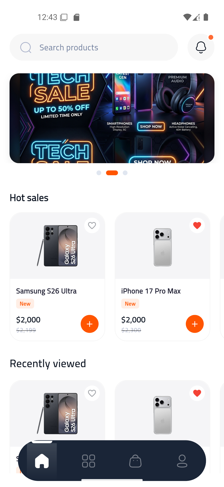
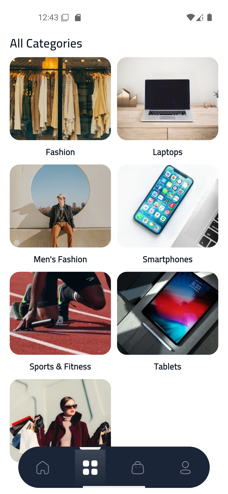
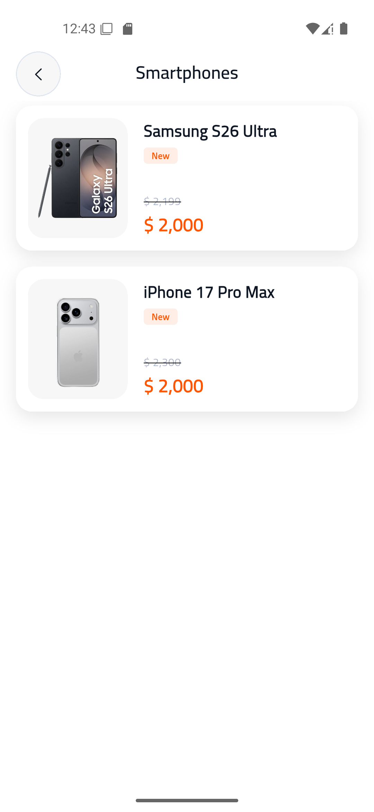
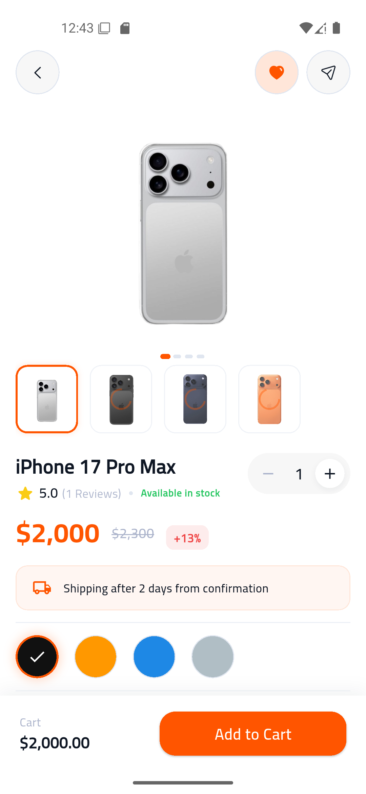
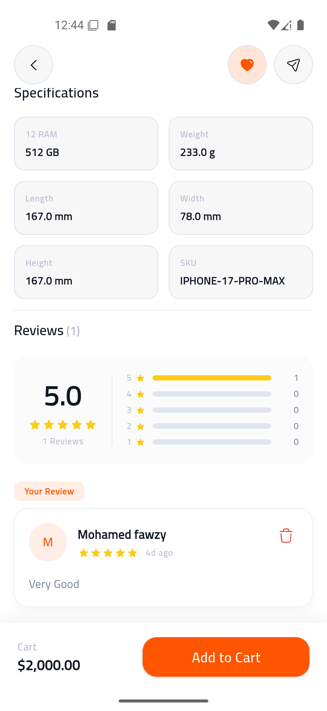
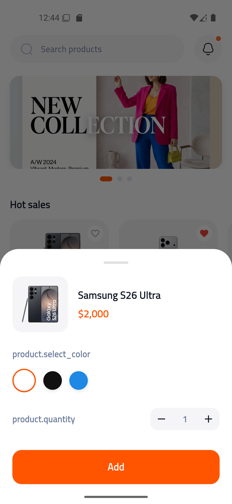
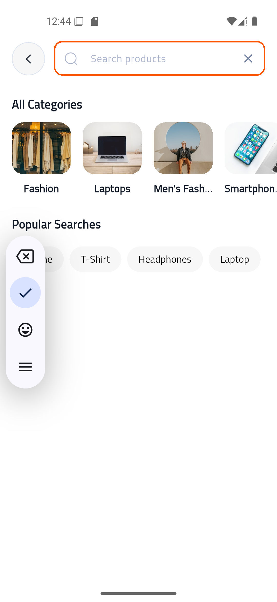
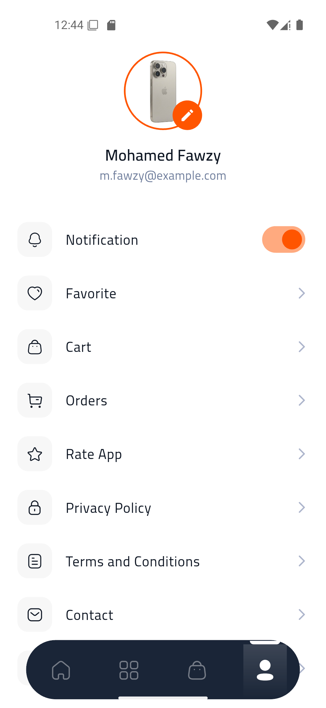
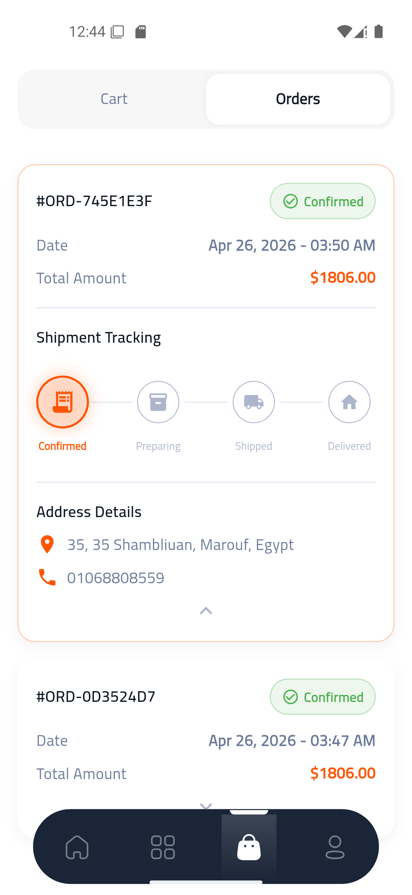
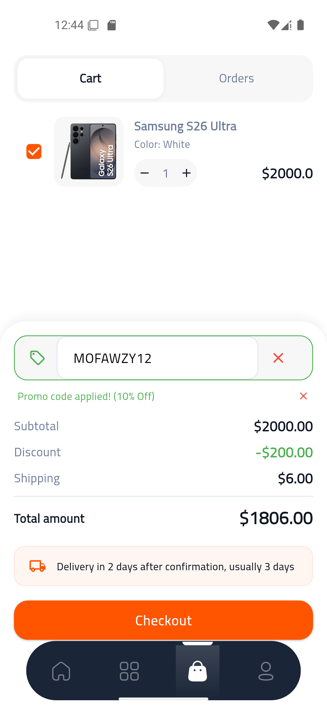

# 🛍️ Modern E-Commerce App

[](https://flutter.dev)
[](https://supabase.com)
[](https://dart.dev)
[](https://blog.cleancoder.com/uncle-bob/2012/08/13/the-clean-architecture.html)

A premium, feature-rich E-Commerce mobile application built with **Flutter** and **Supabase**, following **Clean Architecture** principles and a robust design system.

---

## 🌟 Overview | نظرة عامة

This application is designed to provide a seamless and visually stunning shopping experience. It incorporates modern UI trends like **Glassmorphism**, smooth micro-animations, and a highly responsive layout. The project is engineered for scalability and maintainability using the "Clean Architecture" pattern.

تطبيق تجارة إلكترونية متطور ومتميز، تم بناؤه باستخدام **Flutter** و **Supabase**، مع اتباع مبادئ **Clean Architecture** ونظام تصميم قوي. يوفر التطبيق تجربة تسوق سلسة وجذابة بصرياً، مع واجهات مستخدم عصرية وأداء عالٍ.

---

## ✨ Key Features | المميزات الرئيسية

- **🚀 Authentication System**: Secure Login, Registration, and Google Sign-In integration.
- **🔑 Secure Password Recovery**: Multi-step OTP-based password reset flow.
- **💎 Premium UI/UX**: Custom Glassmorphism effects, Lottie animations, and smooth transitions.
- **🌍 Multilingual Support**: Full support for **English** and **Arabic** (RTL support).
- **🌗 Dark & Light Modes**: Dynamic theme switching for a personalized experience.
- **🗺️ Location Services**: Integrated maps for delivery tracking or store locations.
- **🔥 Streak & Loyalty System**: Engaging reward system to keep users active.
- **📝 Product Reviews**: Comprehensive review and rating system for products.
- **⚡ Performance Optimized**: Shimmer/Skeletonizer loading effects and local caching with Hive.

---

## 📸 Screenshots | لقطات من التطبيق

<div align="center">
  <table style="width:100%">
    <tr>
      <td width="20%"></td>
      <td width="20%"></td>
      <td width="20%"></td>
      <td width="20%"></td>
      <td width="20%"></td>
    </tr>
    <tr>
      <td width="20%"></td>
      <td width="20%"></td>
      <td width="20%"></td>
      <td width="20%"></td>
      <td width="20%"></td>
    </tr>
  </table>
</div>

---

## 🛠️ Tech Stack | التقنيات المستخدمة

- **State Management**: [Flutter BLoC / Cubit](https://pub.dev/packages/flutter_bloc)
- **Database & Auth**: [Supabase](https://supabase.com)
- **Local Storage**: [Hive](https://pub.dev/packages/hive)
- **Networking**: [Dio](https://pub.dev/packages/dio) & [Pretty Dio Logger](https://pub.dev/packages/pretty_dio_logger)
- **Navigation**: [GoRouter](https://pub.dev/packages/go_router)
- **Dependency Injection**: [GetIt](https://pub.dev/packages/get_it) & [Injectable](https://pub.dev/packages/injectable)
- **UI & Animations**: [Lottie](https://pub.dev/packages/lottie), [Shimmer](https://pub.dev/packages/shimmer), [Skeletonizer](https://pub.dev/packages/skeletonizer)
- **Responsive Design**: [Flutter ScreenUtil](https://pub.dev/packages/flutter_screenutil)
- **Localization**: [Easy Localization](https://pub.dev/packages/easy_localization)

---

## 🏗️ Architecture | المعمارية

The project follows a strict **Clean Architecture** to ensure separation of concerns:

- **Core**: Contains shared utilities, design tokens, and common widgets.
- **Features**: Each feature (e.g., auth, products, settings) is isolated into:
  - `Data`: Models, Repositories Implementation, and Data Sources.
  - `Domain`: Entities, Repositories Interfaces, and Use Cases.
  - `Presentation`: Cubits/Blocs, Pages, and Widgets.

---

## 🚀 Getting Started | البدء

### Prerequisites
- Flutter SDK: `^3.10.0`
- Dart SDK: `^3.10.0`

### Installation
1. **Clone the repository**:
   ```bash
   git clone https://github.com/M-Fawzy2004/Ecommerce.git
   ```
2. **Navigate to project directory**:
   ```bash
   cd Ecommerce
   ```
3. **Install dependencies**:
   ```bash
   flutter pub get
   ```
4. **Generate code (Injectable/JSON)**:
   ```bash
   flutter pub run build_runner build --delete-conflicting-outputs
   ```
5. **Run the app**:
   ```bash
   flutter run
   ```

---

## 📜 License
This project is for demonstration purposes. All rights reserved.

---

<div align="center">
  <p>Made with ❤️ by <b>M-Fawzy2004</b></p>
</div>
